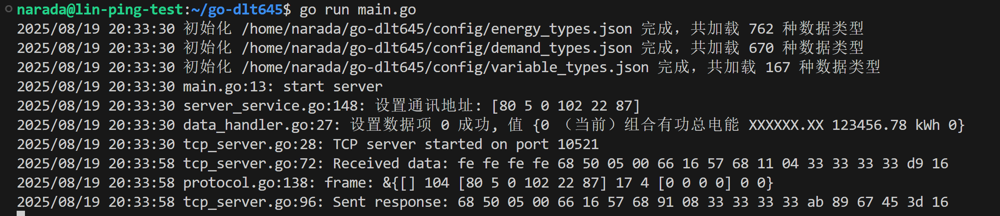
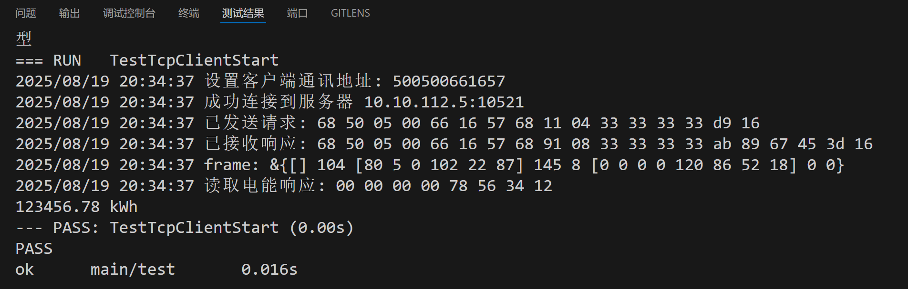

# DLT645协议多语言实现库

一个功能完整的DLT645电能表通信协议的多语言实现项目，同时支持C++、Python和Go三种编程语言，提供了统一的接口和功能。

## 🌴通讯支持

| 功能                            | 状态 |
| ------------------------------- | ---- |
| **TCP客户端（方便通讯测试）** 🐾 | ✅    |
| **TCP服务端（方便通讯测试）** 🐾 | ✅    |
| **RTU主站** 🐾                   | ✅    |
| **RTU从站** 🐾                   | ✅    |

## 🌴 功能完成情况

| 功能                                           | 状态 |
| ---------------------------------------------- | -- |
| **读、写通讯地址** 🐾  | ✅  |
| **广播校时** 🐾  | ✅  |
| **电能量** 🐾  | ✅  |
| **最大需量及发生时间** 🐾         | ✅ |
| **变量** 🐾                | ✅ |
| **参变量** 🐾            | ✅ |
| **事件记录** 🐾                 | ❌ |
| **冻结量** 🐾               | ❌ |
| **负荷纪录** 🐾           | ❌ |

因为本人使用DLT645协议需求大多是读取电能表上的电能、需量、变量等数据，后续的功能暂无开发计划，如果需要可以联系我

## 选择语言版本

请选择您感兴趣的语言版本查看详细文档：

- [C++版本](../cpp/README.md)
- [Python版本](../python/README.md)
- Go版本

## DLT645-2007 Protocol Implementation in Go

这是一个完整的DLT645-2007电能表通信协议的Go实现，支持TCP和RTU两种通信方式，提供了完整的客户端和服务端功能。

### 目录结构

```bash
├── config
├── dlt645
│   ├── common
│   ├── model
│   │   ├── data       # 数据模型
│   │   │   └── def    
│   │   └── type       # dlt645数据类型
│   ├── protocol       # 协议解析层
│   ├── service
│   │   ├── clientsvc  # dlt645客户端api及实现
│   │   └── serversvc  # dlt645服务端api及实现
│   └── transport
│       ├── client     # 客户端通讯接口,支持TCP客户端、RTU主站
│       └── server	   # 服务端通讯接口,支持TCP服务端、RTU从站
└── test  # 测试文件
```

### 使用方法

1. 创建DLT645从站

   ```go
   func TestRTUServerStart(t *testing.T) {
   	serverSvc, err := serversvc.NewRtuServer("/dev/ttyS0", 8, 1, 9600, serial.ParityNone, 5*time.Second)
   	if err != nil {
   		t.Fatalf("创建RTU服务器失败: %v", err)
   	}
   	serverSvc.SetAddress([]byte{0x50, 0x05, 0x00, 0x66, 0x16, 0x57})
   
   	// 启动服务器
   	if err := serverSvc.Server.Start(); err != nil {
   		t.Fatalf("启动RTU服务器失败: %v", err)
   	}
   }
   ```

2. 创建DLT645主站

   ```go
   func TestRtuClientStart(t *testing.T) {
   	clientSvc, err := clientsvc.NewRtuClient("COM1", 2400, 8, 1, serial.ParityNone, 5*time.Second)
   	if err != nil {
   		t.Fatalf("创建RTU客户端失败: %v", err)
   	}
   	clientSvc.SetAddress([]byte{0x50, 0x05, 0x00, 0x66, 0x16, 0x57})
   
   	// 连接服务器
   	if err := clientSvc.Conn.Connect(); err != nil {
   		t.Log("连接服务器失败")
   		t.Fatal(err)
   	}
   }
   ```

3. 服务端接口（注释的接口待实现）

   ```go
   type DLT645Server interface {
   	HandleRequest(frame *protocol.Frame) ([]byte, error) // 处理请求
   	Set00(di uint32, value float32) (bool, error)        // 写电能量
   	Set01(di uint32, value *model.Demand) (bool, error)  // 写最大需量及发生时间
   	Set02(di uint32, value float32) (bool, error)        // 写变量
   	// Set03(di uint32, value uint32) (bool, error)       // 写事件记录
   	// Set04(di uint32, value uint32) (bool, error)          // 写参变量
   	// Set05(di uint32) (bool, error)                        // 写冻结
   	// Set06(di uint32) (bool, error)                        // 写负荷记录
   	// Set(di uint32, bytes []byte) (*model.DataItem, error) // 写数据
   	SetAddress(address []byte) error // 写通信地址
   	// TimeCalibration(dateTime []byte) error // 广播校时
   	// SetFreeze(address []byte, date []byte) error          // 冻结命令
   	// ChangeCommunicationRate(rate CommunicationRate) error        // 更改通信速率
   	// ChangePassword(oldPassword []byte, newPassword []byte) error // 修改密码
   	// MaximumDemandReset() error                                   // 最大需量清零
   	// MeterReset() error                                           // 电表清零
   	// EventReset(di []byte) error                                  // 事件清零
   }
   ```

4. 客户端接口（注释的接口待实现）

   ```go
   type Dlt645Client interface {
   	Read00(di uint32) (*model.DataItem, error) // 读电能量
   	Read01(di uint32) (*model.DataItem, error) // 读最大需量及发生时间
   	Read02(di uint32) (*model.DataItem, error) // 读变量
   	// Read03(di uint32) (*model.DataItem, error)              // 读事件记录
   	// Read04(di uint32) (*model.DataItem, error)              // 读参变量
   	// Read05(di uint32) (*model.DataItem, error)              // 读冻结
   	// Read06(di uint32) (*model.DataItem, error)              // 读负荷记录
   	// Write(di uint32, bytes []byte) (*model.DataItem, error) // 写数据
   	ReadAddress() ([]byte, error)      // 读通信地址
   	WriteAddress(address []byte) error // 写通信地址
   	// TimeCalibration(dateTime []byte) error                  // 广播校时
   	// Freeze(address []byte, date []byte) error               // 冻结命令
   	// ChangeCommunicationRate(rate CommunicationRate) error        // 更改通信速率
   	ChangePassword(oldPassword []byte, newPassword []byte) error // 修改密码
   	// MaximumDemandReset() error                                   // 最大需量清零
   	// MeterReset() error                                           // 电表清零
   	// EventReset(di []byte) error                                  // 事件清零
   }
   ```

### 例子

#### 使用服务端和客户端互测

为了方便测试，这里使用TCP服务端和客户端

1. 启动DLT645服务端并设置电能数据

   ```go
   func main() {
   	common.InitLogger()
   	defer common.LogFile.Close()
   	log.Println("start server")
   
   	serverSvc, err := serversvc.NewTcpServer("10.10.112.5", 10521, 5*time.Second)
   	if err != nil {
   		log.Printf("创建TCP服务器失败: %v", err)
   	}
   	serverSvc.SetAddress([]byte{0x50, 0x05, 0x00, 0x66, 0x16, 0x57})
   
   	// 设置电能数据
   	serverSvc.Set00(0x00000000, 123456.78)
   
   	// 启动服务器
   	if err := serverSvc.Server.Start(); err != nil {
   		log.Printf("启动TCP服务器失败: %v", err)
   	}
   }
   ```

   

2. 启动DLT645客户端读取电能数据

   ```go
   func TestTcpClientStart(t *testing.T) {
   	clientSvc, err := clientsvc.NewTcpClient("10.10.112.5", 10521, 5*time.Second)
   	if err != nil {
   		t.Fatalf("创建TCP客户端失败: %v", err)
   	}
   	clientSvc.SetAddress([]byte{0x50, 0x05, 0x00, 0x66, 0x16, 0x57})
   
   	// 连接服务器
   	if err := clientSvc.Conn.Connect(); err != nil {
   		t.Log("连接服务器失败")
   		t.Fatal(err)
   	}
   
   	dataItem, err := clientSvc.Read01(0x00000000)
   	if err != nil {
   		t.Log("读取数据项失败")
   		t.Fatal(err)
   	}
   	fmt.Printf("%.2f %v\n", dataItem.Value.(float32), dataItem.Unit)
   }
   ```

   

#### 使用第三方工具测试

模拟测试软件地址

[https://www.redisant.cn/dl645master]: https://www.redisant.cn/dl645master

测试效果

